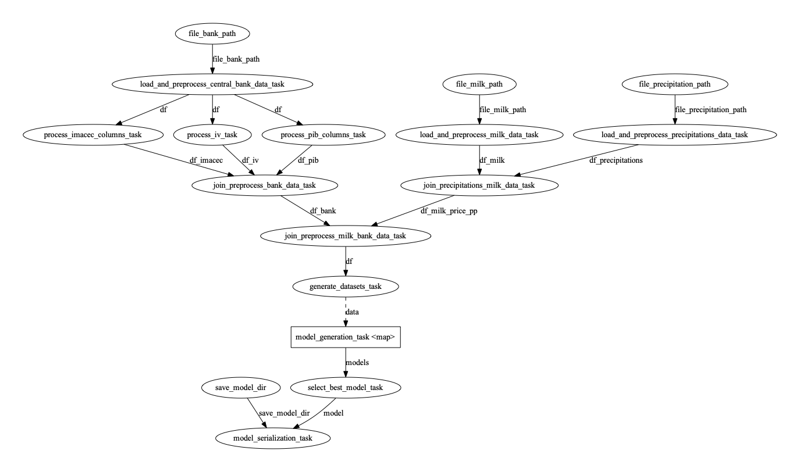

# Bain challenge

This repository implements a prefect pipeline to train a milk price model predictor.

## Approach

Before pipeline implementation a little research was done in order to choose a machine learning pipeline framework.
My experience is based mostly on kubeflow but it have some drawbacks related with local running and it's highly coupled
to GCP despiting that is a open source framework.
After the research a promising framework appears called prefect with a really active and responsive community,
the github repository is really active and it provides a really easy way to test pipelines locally.
Also it has the option to deploy the pipeline on cloud or prefect server.

https://github.com/PrefectHQ/prefect

## Notebook

After choosing the framework the jupyter notebook was executed locally and at this some differences appears:

- After running jupyter notebook locally the shape of "precio_leche_pp_pib" dataframe changed from (90, 49) to (76, 49)
  this shape is equivalent to the generated by prefect pipeline implemented for preprocessing.
    - Given this change the trained model is different to the implemented by the data science.
- After the first model generation the selected features also changed.
- The last model generated doesn't have many sense given that is removing columns that contains "leche" keyword on the
  name but there aren't columns with leche on the training dataset, despiting this a task to generate more than one
  dataset is generated on the pipeline in order to train more than one model and then select the best one.

## Pipeline implementation

The pipeline have some tasks that are done in parallel to improve performance such as central bank preprocessing and
model training.
The generated looks like this:



To run the pipeline locally it's necessary to generate a new virtual environment with any environment tool.
For example to generate the environment with virtualenv and run the pipeline run the follow commands at project root:

```
python3 -m pip install virtualenv
python3 -m virtualenv pipeline-env
source pipeline-env/bin/activate
pip install requirements.txt
python pipeline.py
```

The pipeline execution receives two arguments that are initialized with values by default, to check the available flags
please run:

```
python pipeline.py --help
```

Example of pipeline execution in parallel with 8 workers:

```
python pipeline.py -p True -w 8
```

### Log level

To change log level please update the follow env variable with the desire level: PREFECT__LOGGING__LEVEL.
Example:

```
export PREFECT__LOGGING__LEVEL=DEBUG
```

## Endpoint usage

To test the generated model in an endpoint it's necessary to have docker installed on your machine.
With docker installed run the follow command to generate the docker image locally:

```
docker build --build-arg MODEL_VERSION=0.1.0 -t ml-milk-app:latest .
```

To run the fastapi server with docker run the follow command:

```
docker run -d --name milk-api -p 80:80 ml-milk-app:latest
```

Finally to test the endpoint locally, here we provide an example:

```
curl -X POST "http://127.0.0.1:80/milk-price/predict" -H\
 "accept: application/json"\
 -H "Content-Type: application/json"\
 -d "{\"data\":[[2.01400000e+03,2.19030000e+02,2.00000000e+00,1.68885621e+00,8.38985390e+00,1.78030705e+01,7.29517830e+00,3.01593178e+00, \
 2.21861968e+01,4.31574106e+01,6.52280104e+01,5.89162366e+08,5.30628153e+08,1.18979099e+08,1.07686125e+08,1.12929737e+08,\
 1.17324454e+08,3.26848287e+08,1.51002582e+08,2.47771010e+07,5.84892910e+07,9.85263519e+08,9.87746023e+08,1.69050011e+08,\
 6.37721806e+08,1.82004135e+08,2.76725914e+08,6.21419201e+08,1.06567859e+08,2.15199970e+07,5.30525285e+08,3.29424874e+08,\
 6.02969763e+08,1.16462931e+08,8.29465384e+08,6.90060504e+08,5.23184092e+08,9.85454361e+08,1.07497828e+08,9.35000000e+01,\
 9.82000000e+01,9.42000000e+01,9.18000000e+01,1.07454000e+02,1.02175000e+02,8.88000000e+01,9.37100000e+01,9.34000000e+01]]}"
```

The response looks like this:

```
{"prediction":[208.47223831852565]}
```

## Decisions

- Given that data is loaded from a local file is implemented in the same function that does preprocess logic.
- If the data is in an external data source it's necessary create a new task just for data loading with retry mechanism
  provided by prefect.
- The api was developed with FastAPI.
- The coverage was not addressed with priority.
- Logging is implemented with priority in order to check info, errors and debugging.
- There are two docker files:
    - Dockerfile: this one correspond to FastAPI image
    - Dockerfile.pipeline: this image is generated to run the generated pipeline in a docker container in interactive
      mode
- The code is not directly decorated with task for prefect, in this way is easier migrate from prefect framework to
  another one if necessary.
- The prefect tasks are just functions wrappers with prefect logging included.
- The metric used for model selection is r2

## Future work

- Implement monitoring
- Create a new task that can be configured for hyperparameter search process.
- Create a logger decorator for pipeline tasks to avoid duplicated code.
- Create a docker image for pipeline execution with slim-buster
